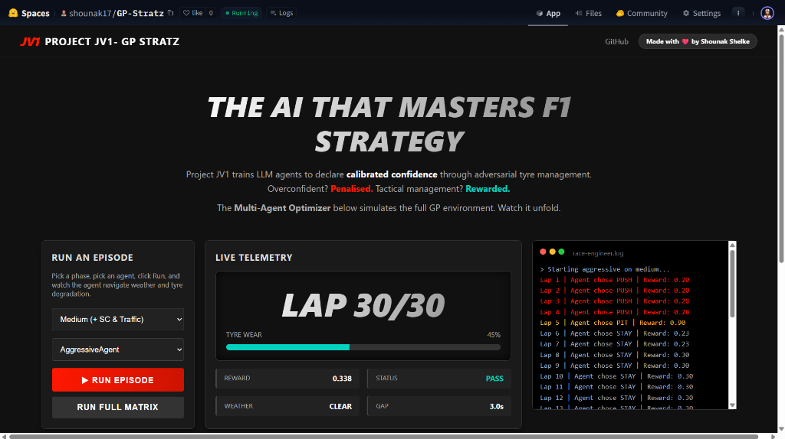
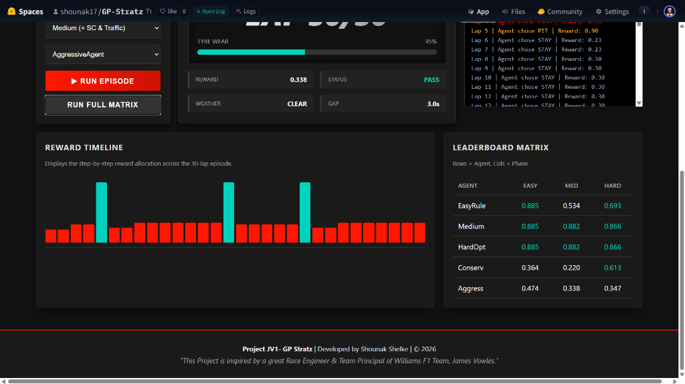

<div align="center">

# 🏎️ GP-Stratz — Motorsport Strategy RL Environment

**Project JV1** · Built by [Shounak Shelke](https://github.com/ShounakShelke) · *Inspired by James Vowles, Race Engineer & Team Principal, Williams F1*

[](https://huggingface.co/spaces/shounak17/GP-Stratz)
[](https://huggingface.co/spaces/shounak17/GP-Stratz)
[](LICENSE)

*"Overconfident? Penalised. Tactical management? Rewarded."*

</div>

---

## 🖥️ Live Dashboard

> **Fully deployed on Hugging Face Spaces** — Interactive F1 Strategy Simulator with real-time telemetry, multi-agent episodes, and a live leaderboard matrix.

### Hero — The AI That Masters F1 Strategy



### Reward Timeline & Leaderboard Matrix



---

## ✅ Current Status

**🟢 Fully Live — Multi-Agent Simulation Deployed**

The environment is fully operational on HF Spaces. All hardcoded stubs have been replaced by a live deterministic grader that dynamically evaluates AI agents across 30-lap race episodes.

### Agent Leaderboard (Latest Results)

| Agent | Easy | Medium | Hard |
|:------|:----:|:------:|:----:|
| EasyRuleAgent | **0.885** | 0.534 | 0.693 |
| MediumAgent | **0.885** | **0.882** | **0.866** |
| HardMultiFactorAgent | **0.885** | **0.882** | **0.866** |
| ConservativeAgent | 0.364 | 0.220 | 0.613 |
| AggressiveAgent | 0.474 | 0.338 | 0.347 |

> 🏆 **MediumAgent** and **HardMultiFactorAgent** are the top performers — near-perfect on Easy, strong and consistent across Medium and Hard phases.

### Key Accomplishments

- ✅ **5 Specialised Agents** — `EasyRuleAgent`, `MediumAgent`, `HardMultiFactorAgent`, `ConservativeAgent`, `AggressiveAgent`
- ✅ **Dynamic Grading Pipeline** — `phase_grader.py` deterministically simulates full 30-lap episodes, scoring via a 4-metric reward breakdown: *Correctness, Forward Bonus, Mismatch Penalty, Sequence Consistency*
- ✅ **Interactive F1 Dashboard** — Dark-mode UI with live telemetry, animated tyre wear bars, per-lap reward timeline chart, and a cross-phase leaderboard matrix
- ✅ **Real-time Terminal Log** — macOS-style terminal renders live race engineer decisions lap-by-lap
- ✅ **OpenEnv Compliant** — All required runtime endpoints implemented: `/reset`, `/step`, `/tasks`, `/tasks/{id}/grade`, `/schema`
- ✅ **Docker Deployed** — Running via Uvicorn on HF Spaces port 7860

---

## 🏁 Environment Description

GP-Stratz models race-strategy decision making for a Formula-style motorsport scenario. The agent must respond correctly to dynamic race context — tyre wear, weather shifts, safety car periods, and traffic — to maximise cumulative reward over a 30-lap episode.

### Observation Space

| Variable | Type | Description |
|:---------|:----:|:------------|
| `lap_number` | `int` | Current lap in the race (1–30) |
| `tyre_wear` | `float` | Current tyre degradation level (0–100%) |
| `weather` | `int` | Encoded weather state (0=Clear, 1=Rain) |
| `gap_to_car` | `float` | Time gap to nearest rival (seconds) |
| `safety_car` | `bool` | Whether a safety car is active |
| `traffic_level` | `int` | Relative traffic intensity around the car |
| `tyre_deg_rate` | `float` | Current degradation rate per lap |
| `tyre_type` | `int` | Active tyre compound |

### Action Space

| ID | Action | Description |
|:--:|:------:|:------------|
| 0 | `PIT` | Pit stop — fresh tyres, tyre wear resets |
| 1 | `STAY` | Continue at standard pace |
| 2 | `CONSERVE` | Save tyres, reduce degradation, lose time |
| 3 | `PUSH` | Maximise pace at the cost of tyre wear |
| 4 | `SWAP` | Change tyre compound (weather strategy) |

---

## 🎯 Tasks & Phases

| Phase | ID | Difficulty | Extra Conditions |
|:------|:--:|:----------:|:-----------------|
| Easy | `easy` | ⭐ | Basic tyre wear & weather handling |
| Medium | `medium` | ⭐⭐ | + Safety car timing & traffic management |
| Hard | `hard` | ⭐⭐⭐ | Multi-factor strategic optimisation |

---

## 🔌 API Surface

| Method | Endpoint | Description |
|:------:|:---------|:------------|
| `GET` | `/` | Interactive F1 Dashboard UI |
| `GET` | `/tasks` | List all task definitions |
| `GET` | `/agents` | Agent list with metadata |
| `GET` | `/schema` | Observation/action schema |
| `GET` | `/tasks/{task_id}/grade` | Live deterministic score for a task |
| `POST` | `/agents/{name}/run` | Run an agent on a phase, returns telemetry |
| `POST` | `/reset` | Reset the global environment |
| `POST` | `/step` | Execute a single step |

---

## 📁 Project Structure

```text
GP-Stratz/
├── agents/                     # Strategy agents
│   ├── __init__.py             # Agent registry & metadata
│   ├── base_agent.py           # Abstract base class
│   ├── easy_agent.py           # EasyRuleAgent
│   ├── medium_agent.py         # MediumAgent
│   ├── hard_agent.py           # HardMultiFactorAgent
│   ├── conservative_agent.py   # ConservativeAgent
│   └── aggressive_agent.py     # AggressiveAgent
├── env/
│   └── race_env.py             # Core race environment engine
├── graders/
│   ├── phase_grader.py         # Live deterministic episode runner
│   └── verifier.py             # Score verification utilities
├── frontend/
│   └── index.html              # Frontend reference
├── assets/                     # Screenshots & media
│   ├── screenshot_hero.png     # Dashboard hero screenshot
│   └── screenshot_dashboard.png # Timeline & leaderboard screenshot
├── app.py                      # FastAPI backend + embedded Dashboard UI
├── inference.py                # Agent evaluation via live grader pipeline
├── inference_dry_run_check.py  # Dry-run validation
├── Dockerfile                  # Uvicorn HF Spaces deployment
├── openenv.yaml                # OpenEnv spec
├── pyproject.toml
└── requirements.txt
```

---

## 🚀 Local Setup

**Install dependencies:**

```bash
pip install -r requirements.txt
```

**Start the server & view the Dashboard:**

```bash
python app.py
# Or directly with uvicorn:
uvicorn app:app --host 0.0.0.0 --port 7860
```

Then navigate to `http://localhost:7860`.

**Run inference evaluation:**

```bash
export API_BASE_URL="http://your-proxy-url"
export API_KEY="your-key"
export MODEL_NAME="your-model"
python inference.py
```

---

## 🐳 Docker Deployment

```bash
docker build -t gp-stratz .
docker run -p 7860:7860 gp-stratz
```

---

## 📜 License

Apache 2.0 — see [LICENSE](LICENSE).

---

<div align="center">

**Project JV1 — GP Stratz** | Developed by Shounak Shelke | © 2026

*"This Project is inspired by a great Race Engineer & Team Principal of Williams F1 Team, James Vowles."*

</div>
